# 背景

由于之前一直都不会Git Bash，让我很难绷，所以今天在这里稍微学习一下

参考网址：[Git教程 Git Bash详细教程-CSDN博客](https://blog.csdn.net/qq_36667170/article/details/79085301)

# 基本操作

与Linux命令行类似，Git Bash有如下的基本操作：

|     操作     |            含义            |                             图例                             |
| :----------: | :------------------------: | :----------------------------------------------------------: |
|      cd      |        进入某一路径        | 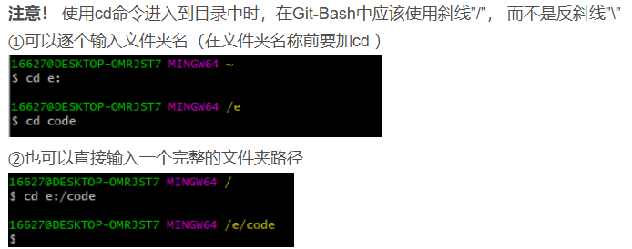 |
|     pwd      |        显示当前路径        | 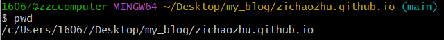 |
|      ls      |    查看当前文件夹的文件    | 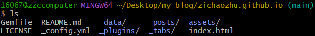 |
|    cd ..     |      退回上一级文件夹      | 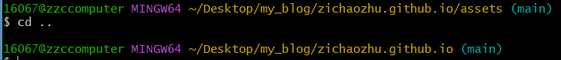 |
| mkdir folder | 创建一个名叫folder的文件夹 | 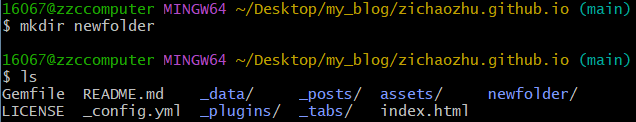 |
|  touch file  |      创建一个file文件      | 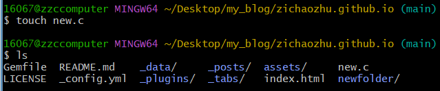 |
| rm -r folder |      删除folder文件夹      | 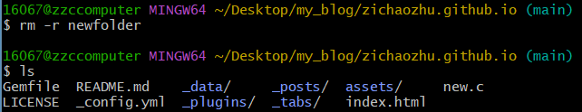 |
|   rm flie    |        删除file文件        | 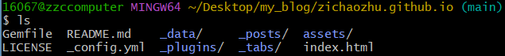 |

# 仓库设置

我们需要一个本地的仓库（本机），也需要一个远程的仓库（Github）

## 初始化仓库

使用命令：`$ git init`

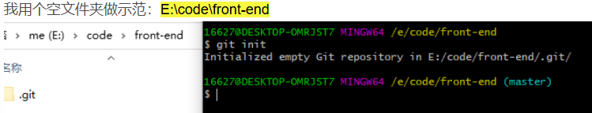

初始化成功以后，你的文件夹中就会多出.git隐藏文件，不可以乱删

## 新建远程仓库

略。详细可以看博客

## 建立连接

### SSH连接

找到仓库地址以及连接地址（SSH），使用`$ git remote add + 名字 + 连接地址`命令

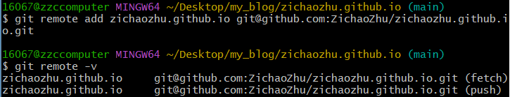

### HTTPS连接

操作与SSH连接类似

### 查看和断开连接

#### 查看

使用`$ git remote -v`，可以查看是否连接上了远程仓库

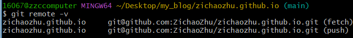

#### 断开连接

使用`git remote remove origin`，其中，origin为远程仓库名称

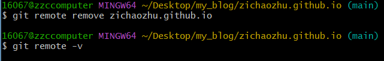

# 文件上传

## 添加暂存区

**git add** 将**修改的文件**添加暂存区，也就是将要提交的文件的信息添加到索引库中。

### 命令介绍

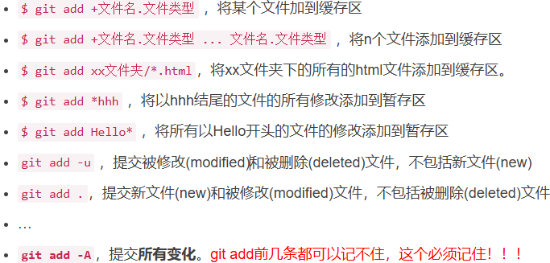

|             命令              |                             含义                             |
| :---------------------------: | :----------------------------------------------------------: |
|         git add file          |                     将某个文件加到缓存区                     |
| git add file1 file2 ... fileN |                    将N个文件添加到缓存区                     |
|    git add xxfoler/*.html     |           将xx文件夹下的所有的html文件添加到缓存区           |
|         git add *hhh          |         将**以hhh结尾**的文件的所有修改添加到暂存区          |
|        git add Hello*         |        将所有**以Hello开头**的文件的修改添加到暂存区         |
|          git add -u           | 提交被修改(modified)和被删除(deleted)文件，不包括新文件(new) |
|        **git add -A**         | 提交**所有变化**。*git add前几条都可以记不住，这个必须记住！！！* |

## 保存到仓库的历史记录

**你现在可以简单的理解为给你刚才add的东西加一个备注，你上传到远程仓库之后，修改的文件后边会显示这个备注**

命令：`git commit -m "修改注释"`

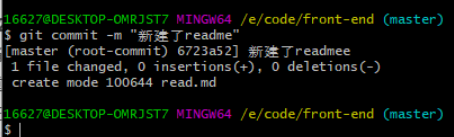

*一定要加`-m`，否则会进入vim编辑器，对新手很不友好，所以还是加上`-m`*

## 将文件上传

向一个空的新仓库中推文件：`$ git push -u 仓库名称 分支`

例如：

* 仓库名称：zichaozhu.github.io
* 分支：main、master

### 什么时候加上 -u 参数

> 我们第一次推送master分支时，加上 **–u**参数才会把本地的master分支和远程的master分支关联起来，就是告诉远程仓库的master分支，我的本地仓库和是对着你的哦，不是对着别的分支的哦。
> 只有第一次推的时候需要加上-u，以后的推送只输入：
> `git push 名称 分支`

### 强制推送

`git push origin master -f`

如果你某次推送失败，git bash报错，你懒得处理错误，你就可以用这个。但是有风险，因为报错90%是因为你本地仓库和远程仓库数据发生冲突，使用这个会直接用本地数据覆盖掉远程数据，可能损失数据哦。

# 其他

略。详见博文4.4.4，关于`git log`的命令(对提交信息的修改)

# 文件下拉

上边push报错，我自己知道数据差在哪里，所以使用了强制推送。但是在团队合作中，push报错，那铁定是你队友修改了远程仓库，如果你再强制上传，那你就是毁了你队友的代码。**所以如何保证在你修改之前，自己的文件跟远程仓库一致呢**

## git pull 仓库名称

使用后本地会下来，commit记录会显示

## git fetch + git merge

- git fetch 将数据拉下来，但是没修改本地的commit和文件
- git merge 改变本地数据

git fetch + git merge = git pull 

# 仓库克隆

可以使用直接下载、使用git desktop的方式，也可以使用Git Bash的方式

仓库是你自己的，你就使用SSH连接，不是你自己的，你没权限你就切换到HTTPS，再复制地址。它克隆下来是一个文件夹，你想把文件夹放哪里就在哪打开gitbash

命令：`git clone + 刚才的地址`

# git pull 和 git clone 的区别

详见博文：[Git教程 git pull 和 git clone的区别_git pull和git clone-CSDN博客](https://lolitasian.blog.csdn.net/article/details/121264178)

