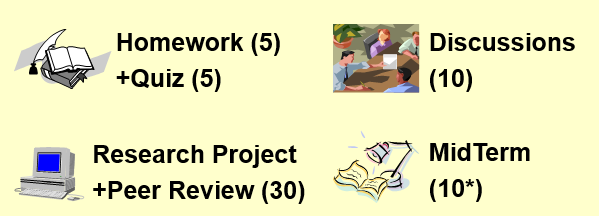
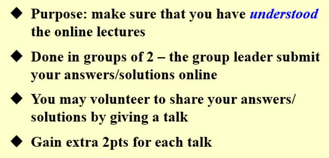
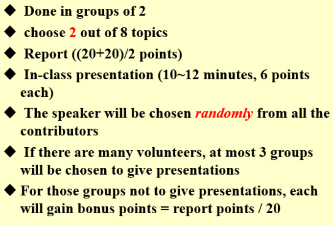

# ADS

## Flip class

### 时间

第二节课开始，10：00~11：35

### 讨论

问题需要在系统中上传提交，下午1点上传，答案可以反复交

## 课程评分方法

* 期末卷面成绩需要高于40分

### Quiz

每一次课的前10分钟（10：00~10：10）有Quiz，大多数是视频中的原题

### Discussion

## Research topics

###
