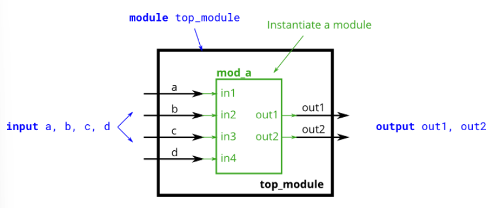

# Connecting ports by name

## Problem statement

> This problem is similar to [module](https://hdlbits.01xz.net/wiki/module). You are given a module named `mod_a` that has 2 outputs and 4 inputs, in some order. You must connect the 6 ports *by name* to your top-level module's ports:

| Port in `mod_a` | Port in `top_module` |
| :-------------: | :------------------: |
|  `output out1`  |        `out1`        |
|  `output out2`  |        `out2`        |
|   `input in1`   |         `a`          |
|   `input in2`   |         `b`          |
|   `input in3`   |         `c`          |
|   `input in4`   |         `d`          |

You are given the following module:

```verilog
module mod_a ( output out1, output out2, input in1, input in2, input in3, input in4);
```



```verilog
module top_module ( 
    input a, 
    input b, 
    input c,
    input d,
    output out1,
    output out2
);

endmodule
```

## Solution

```verilog
module top_module ( 
    input a, 
    input b, 
    input c,
    input d,
    output out1,
    output out2
);
    mod_a inst(
        .out1(out1),
        .out2(out2),
        .in1(a),
        .in2(b),
        .in3(c),
        .in4(d)
    );
endmodule
```

