# Arithmetic for Computer

  ## Computer words

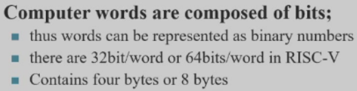

## 补码的一些简单操作

补码可以相加、相减，相乘（补位数）

## 溢出

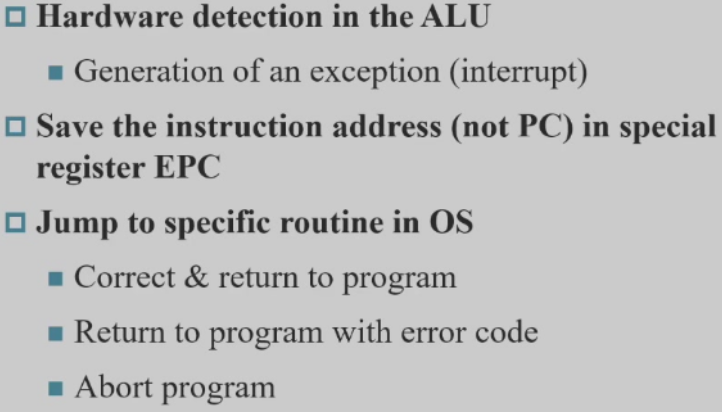

* 检测是否溢出：观察最高位、次高位进位的异或，若是1，则溢出；否则没有

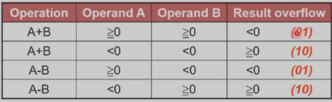

* 将结果扩展一位再进行判断

## Constructiong ans ALU

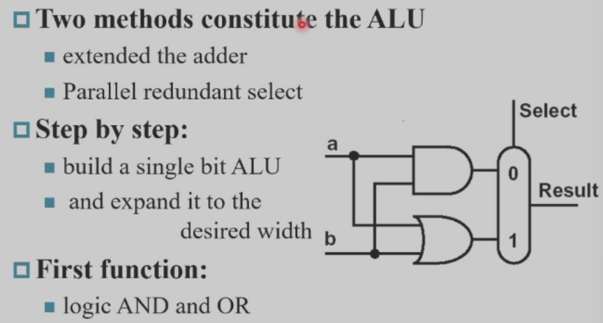

### 全加器

### 1 bit ALU

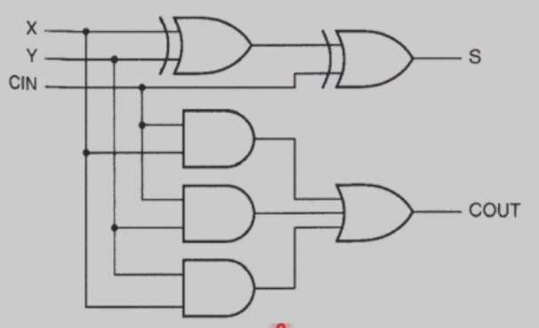

#### Subtraction

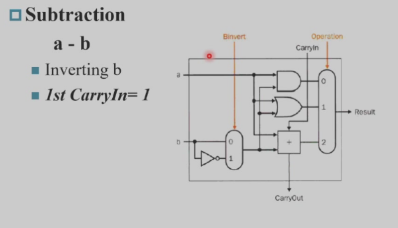

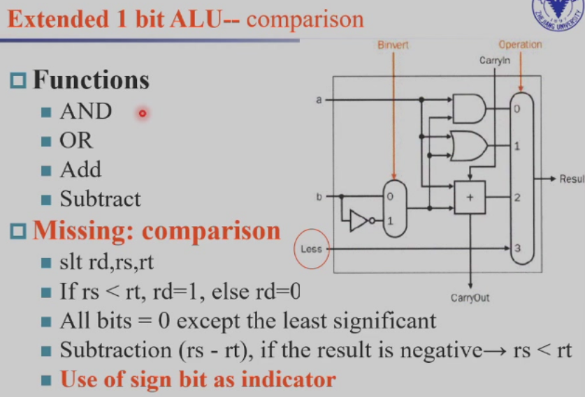

## 超前进位加法器

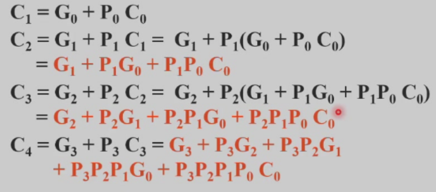

## Carry select adder

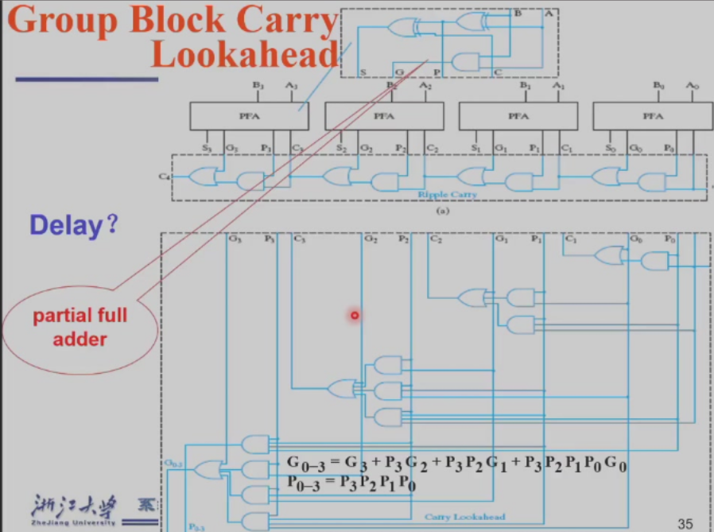

## Multiplier

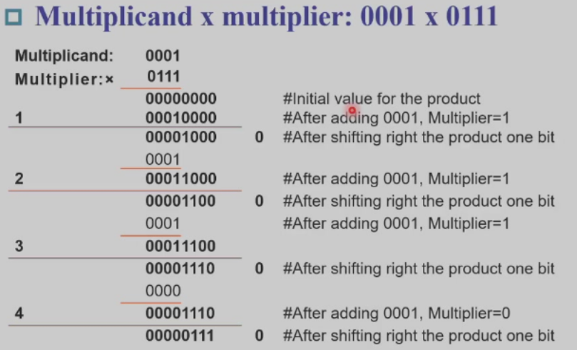

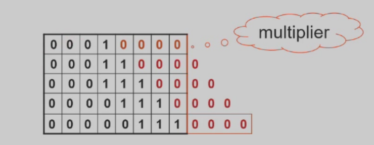

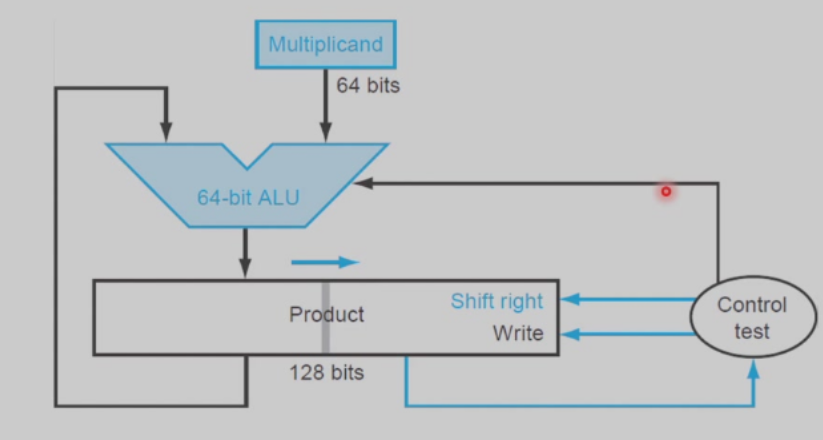
