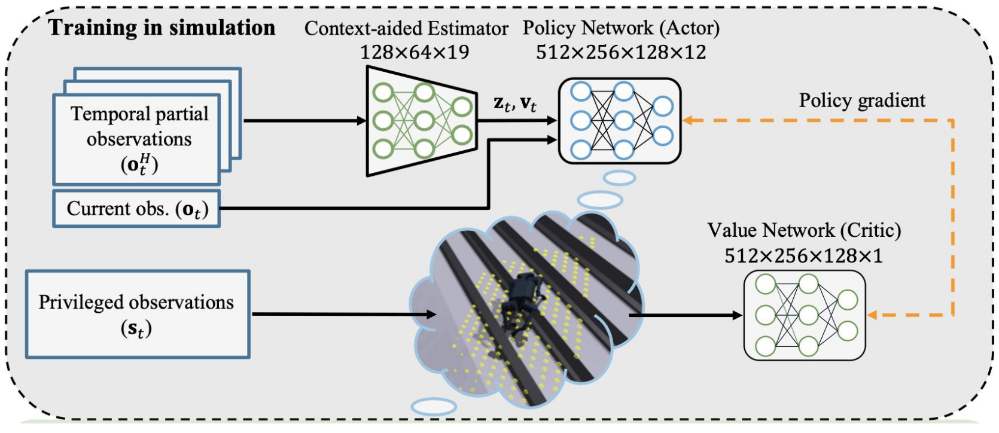

# DreamWaQ

## 核心目标

* 挑战：视觉不可靠: 相机和雷达在烟雾、强光、积雪或高草丛中容易失效。
* 现有方法的局限:  
  * 纯本体感知方法容易产生==状态估计漂移==。
  * 传统的行为克隆限制了性能上限,且难以应对突发干扰
* 核心理念是 **"Implicit Terrain Imagination"（隐式地形想象）**：虽然我看不到路，但我可以通过脚底的触感和身体的动态，在脑海中“想象”出地形的特征 。

## 核心创新

* 策略网络的输入中增加线速度这一参数,解决状态漂移的问题;
* 构建CENet网络,估计线速度和环境潜变量编码。
* 使用actor - critic算法训练策略网络。

### 线速度

* 面对问题：在盲视行走中，机器人仅依赖 **本体感知 (Proprioception)**（如 IMU 和关节编码器）。虽然 IMU 可以测量加速度，但在长时间运行中，通过积分加速度来推算速度和位置会产生累积误差，这被称为 **状态漂移 (Estimation Drift)** 。如果没有准确的速度信息，策略网络很难区分“我在稳定行走”和“我在原地打滑”。
* **目标与思路 (Goal):** 显式地估计机器人的 **身体线速度 (Body Linear Velocity, $v_t$)**，并将其作为一项直接输入喂给策略网络。这样做可以消除累积漂移，显著提高策略的鲁棒性 2。
* **输入 (Input):** 由 **CENet** 网络估算出的线速度向量 $\mathbf{v}_t$
* 过程 (Process): 在策略网络（Actor）的输入层，不仅仅输入关节角度和角速度，还强制拼接了一个由 CENet 实时计算出的线速度向量。
  - 公式参考 Eq. (1) 定义的观测 $o_t$ 结合了 CENet 的输出：
    	$$\pi_{\phi}(a_t | o_t, \mathbf{v}_t, z_t)$$
* **输出 (Output):** 一个包含了自身运动速度认知的状态输入，使得策略网络能输出更抗干扰的动作指令 $a_t$。

### CENet

*核心目的：联合估计身体状态与环境特征*

* **面对问题 (Problem):** 传统的做法通常将“状态估计”（我跑多快？）和“环境识别”（地滑不滑？）分开处理。但论文认为这两者是高度耦合的（例如：地滑会导致跑不快），分开估计效率低且不准 。

* **目标与思路 (Goal):** 构建一个 **上下文辅助估计网络 (CENet)**。它是一个共享编码器的多任务网络，利用 **自动编码器 (Auto-encoder/VAE)** 机制，**联合学习 (Jointly Learn)** 身体速度和环境潜变量 。

* 输入 (Input):

  * **时序部分观测历史 ($\mathbf{o}_t^H$)**：即过去 $H$ 步的本体感知数据（关节信息、IMU数据等。

* 过程 (Process): CENet 包含一个共享编码器和两个分支：

  1. **分支一（显式估计）：** 估计身体线速度 $\mathbf{v}_t$。
     - **损失函数：** ==$\mathcal{L}_{est} = MSE(\hat{v}_t, v_t)$==，即让估计速度尽可能接近仿真器中的真实速度。
  2. **分支二（隐式想象）：** 估计环境潜变量 $\mathbf{z}_t$，并试图重构 **下一时刻的观测 ($\mathbf{o}_{t+1}$)**。
     - **逻辑：** 如果网络能通过 $z_t$ 准确预测下一刻的传感器数据，说明 $z_t$ 已经成功捕获了环境的物理特性（如摩擦、硬度）。
     - 损失函数： 采用 $\beta$-VAE 损失，包含重构损失和 KL 散度损失：
     - ==$\mathcal{L}_{VAE} = MSE(\tilde{o}_{t+1}, o_{t+1}) + \beta D_{KL}(q(z_t|o_t^H) || p(z_t))$==

  * **总优化目标：**==$\mathcal{L}_{CE} = \mathcal{L}_{est} + \mathcal{L}_{VAE}$==。

* **输出 (Output):**
  1. **$\mathbf{v}_t$ (Body Linear Velocity):** 显式的速度估计，用于解决漂移。
  2. **$\mathbf{z}_t$ (Context Vector):** 隐式的环境特征编码，代表了地形的属性（如摩擦系数、地形高度特征）。

### Act - Critic 训练方式

*核心目的：通过非对称信息差实现隐式地形想象*

* **面对问题 (Problem):** 机器人是“盲”的（Actor 只有本体感知），但在训练阶段我们需要根据真实地形来判断它走得好不好。如果只用盲视数据训练，机器人很难学会应对复杂地形。
* **目标与思路 (Goal):** 采用 **非对称 Actor-Critic (Asymmetric Actor-Critic)** 架构 。
  - **Critic (老师):** 拥有“上帝视角”，能看到所有特权信息。
  - **Actor (学生):** 只能看到传感器数据和 CENet 的估计。
  - 通过 Critic 的指导，强迫 Actor 学会仅凭有限信息推断出最优动作，从而实现 **隐式地形想象 (Implicit Terrain Imagination)** 。
* 输入 (Input):
  * **策略网络 (Actor/Policy):** 输入 **非特权信息**，即 $o_t$ (本体感知), $v_t$ (CENet估计速度), $z_t$ (CENet估计环境) 。
  * **价值网络 (Critic/Value):** 输入 **特权信息 ($\mathbf{s}_t$)**。
    - 公式参考 ：==$s_t = [o_t, v_t, d_t, h_t]^T$== 。
    - 其中 $h_t$ 是地形高度图（Height map，直接看到周围地形），$d_t$ 是外部干扰力。
* **过程 (Process):**
  - 使用 **PPO (Proximal Policy Optimization)** 算法进行优化。
  - Critic 计算状态价值 $V(s_t)$，评估在当前真实地形下，机器人的状态好坏。
  - Actor 根据 Critic 反馈的优势函数（Advantage）更新参数，以此来学习如何应对它“看不见”但在 Critic 眼中存在的障碍物（如楼梯）。
* **输出 (Output):** 一个鲁棒的 **策略网络 (Policy Network)**。在实机部署（Zero-shot sim-to-real）时，只需要保留这个 Actor 和 CENet，不再需要 Critic 和特权信息，机器人就能在真实世界中像“看见”了地形一样行走 。

#### 与传统老师学生方法对比

| **对比维度** | **非对称 Actor-Critic (DreamWaQ 采用)**                      | **传统“老师-学生”架构 (RMA 类)**                             |
| ------------ | ------------------------------------------------------------ | ------------------------------------------------------------ |
| **核心逻辑** | **名师指路** (探索)                                          | **照猫画虎** (模仿)                                          |
| **训练流程** | **单阶段并发 (One-Stage)**   策略和评价网络同时训练，效率高 2。 | **双阶段串行 (Two-Stage)**   先练好老师，再让学生去模仿老师的行为 3。 |
| **信息来源** | **Critic (评价者)** 拥有特权信息，给 Actor (学生) 打分 4。   | **Teacher (老师)** 拥有特权信息，直接把动作演示给 Student (学生) 看。 |
| **学生能力** | **无上限**   学生可能通过探索找到比老师更好的解法。          | **受限于老师**   学生的表现很难超过老师 (Behavior Cloning bounds) 5。 |
| **感知方式** | **隐式想象**   为了拿高分，被迫学会“脑补”地形特征 6。        | **显式回归/模仿**   试图逼近老师的动作或环境参数。           |
