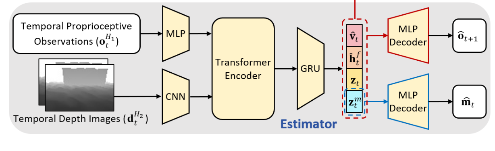

# PIE

## 核心挑战（研究目标）

PIE 旨在解决 **低成本四足机器人（如 Deep Robotics Lite3）在仅配备不可靠深度相机的情况下，如何实现高难度的跑酷运动（如跳跃 3倍身长的沟壑、攀爬 3倍身高的台阶）** 的问题。

现有的机器人跑酷方法存在以下痛点：

* **感知不可靠：** 跑酷需要极其精准的地形感知（特别是在边缘起跳时）。低成本深度相机存在延迟、噪声和视场限制，直接用它来显式重建地形往往不够可靠。
* **训练复杂：** 许多现有方法（如 RMA 的某些变体）采用“两阶段”训练（先练老师再练学生），流程繁琐且存在信息损失。
* **性能受限：** 为了防止因感知误差导致的摔倒，很多算法会限制机器人的运动能力，导致无法发挥其物理极限（比如不敢跳得太远）。

## 创新点

### 双层隐式-显式估计器 (Dual-Level Implicit-Explicit Estimator)

* 面临问题
  * **单一感知不可靠：** 深度相机有延迟、噪声和盲区（如脚下），直接画地图（显式）容易出错 。
  * **盲走上限低：** 仅靠本体感知（隐式）无法预判远处障碍（如深沟），无法提前蓄力 。
* 目标
  * **双重理解：** 同时获取环境的“显式几何形状”（地图）和“隐式物理特性”（未来预测）。
  * **鲁棒融合：** 通过时序记忆和多模态融合，在视觉失效时能退回本体感知。
* 输入
  * **时序深度图像 ($d_t^{H_2}$)**：最近 2 帧的深度图堆叠。
  * **时序本体感知 ($o_t^{H_1}$)**：最近 10 帧的关节/IMU数据。
* 过程与方程
  * **特征融合：** 使用 **Transformer** 融合视觉与触觉特征，再送入 **GRU** 生成包含记忆的状态编码 。
  * 双层估计机制：
    * **理解层：** 同时重构 **地形高度图 $\hat{m}_t$**（显式看见）和 **下一时刻本体状态 $\hat{o}_{t+1}$**（隐式预测未来）。
    * **表达层：** 同时输出 **显式物理量**（速度 $\hat{v}_t$、足间隙 $\hat{h}_t^f$）和 **隐式潜变量**（$z_t, z_t^m$）。
  * 损失方程：
    * $$\mathcal{L} = \underbrace{D_{KL}(q||p)}_{\text{VAE正则}} + \underbrace{MSE(\hat{o}_{t+1}, o_{t+1})}_{\text{隐式预测}} + \underbrace{MSE(\hat{m}_t, m_t)}_{\text{显式地图}} + \underbrace{MSE(\hat{v}_t, v_t) + MSE(\hat{h}_t^f, h_t^f)}_{\text{显式物理量}}$$
* 输出 (给 Actor)
  * $\hat{v}_t$ (线速度)、$\hat{h}_t^f$ (足间隙)、$z_t^m$ (地形编码)、$z_t$ (环境潜变量) 。

### 单阶段非对称训练框架 (One-Stage Asymmetric Framework)

为将两阶段训练范式简化为单阶段,采用了非对称的 actor-critic 架构:

* 面临问题
  * **两阶段低效：** “先练老师、后练学生”的流程复杂，且学生模仿老师时存在信息损失，性能被老师锁死 。
  * **多技能整合难：** 很难设计一个奖励函数能同时兼顾跑、跳、爬等多种动作 。
*  目标
  * 

