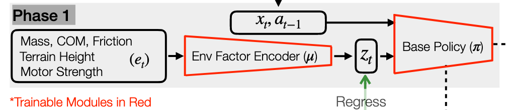

# RMA

## 核心挑战

* 挑战：
  * 仿真环境难以完美模拟真实世界的物理接触和软地面。
  * 真实环境充满了不可预测性(打滑、负载变化、电机磨损)
* 目标：让机器人像动物一样，在无需人工干预的情况下，==毫秒级==适应新环境。实际上，也就是需要机器人具备**实时适应（Online Adaptation）**的能力。

## RMA 方法

RMA = Rapid Motor Adaptation

### 训练阶段

#### 第一阶段：基础策略训练

* Input：

  * **当前状态 ($x_t$):** 机器人的关节位置、速度、身体姿态等本体感知信息。
  * **上一刻动作 ($a_{t-1}$):** 机器人上一帧执行的动作指令。
  * **特权环境信息 ($e_t$):**这是关键。包括质量、质心位置 (COM)、摩擦力、地形高度图、电机强度等。这些信息在现实中很难直接获得，但在仿真里可以直接读取。

* **核心组件与过程 (Process):**

  1. **环境因素编码器 ($\mu$):** 一个多层感知机（MLP）。它接收复杂的特权信息 $e_t$，将其压缩编码为一个低维的潜在向量$z_t$
     * **公式:** $z_t = \mu(e_t)$ 4。
  2. **基础策略 ($\pi$):** 也是一个神经网络。它接收状态 $x_t$、上一动作 $a_{t-1}$ 和环境特征 $z_t$，输出当前动作。
     - **公式:** $a_t = \pi(x_t, a_{t-1}, z_t)$ 5。
  3. **联合训练:** 使用强化学习（RL）算法（具体为 PPO），同时训练编码器 $\mu$ 和策略 $\pi$，最大化奖励函数（如走得快、走得稳。

- **输出 (Output):**
  - **动作 ($a_t$):** 目标关节位置。
  - **环境外在向量 ($z_t$):** 这是环境的“真值”特征。
- **目的:** 训练一个在已知环境参数下能完美行走的“专家策略”。

#### 第二阶段：适应模块训练 (Training Phase 2) — “学会通过感觉猜测环境”

* **Inputs**

  * **历史信息序列:** 过去一段时间（约 0.5秒，k=50步）的**状态 ($x_{t-k:t-1}$)** 和 **动作 ($a_{t-k:t-1}$)** 。

  - *注意：此时不再输入特权信息 $e_t$。*

* **核心组件与过程 (Process):**

  * **适应模块 ($\phi$):** 一个基于 1-D CNN（一维卷积神经网络）的模型，擅长处理时间序列数据 10。

  * **监督学习 (Supervised Learning):** 这是一个回归任务。

    * **目标:** 让适应模块的输出 $\hat{z}_t$ 尽可能接近阶段1中编码器生成的真实 $z_t$。
    * **公式:** 最小化 MSE 损失 $||\hat{z}_t - z_t||^2$。

    - 图片中间绿色的双向箭头 **"Regress"** 就代表了这个监督学习过程。

* **输出 (Output):**

  * **估计的环境向量 ($\hat{z}_t$):** 这是一个对真实环境参数的猜测值。

* **目的:** 只要机器人感觉到“脚底打滑”或者“腿部沉重”（通过历史状态体现），适应模块就能推断出环境发生了变化，并生成对应的 $z_t$，从而能够在没有上帝视角的情况下复现专家的能力。

#### 第三阶段：部署 (Deployment) — “异步协作，盲视行走”

​	这是将模型应用到真实的 Unitree A1 机器人上。此时**环境编码器 ($\mu$) 被丢弃**，只保留策略 ($\pi$) 和适应模块 ($\phi$ )。

- **输入 (Inputs):**
  - 仅依赖机器人的**实时状态 ($x_t$)** 和 **历史状态/动作序列** 15。
  - *现实世界中没有 $e_t$（特权信息）。*
- 核心组件与过程 (Process):这是一个异步 (Asynchronous) 的双线程系统 16161616：+1
  1. **适应模块 ($\phi$) [慢速线程]:**
     - **频率:** 10 Hz (每 0.1秒运行一次)
     - **任务:** 慢慢分析过去 0.5秒的历史数据，更新对环境的估计 $\hat{z}_t$。
  2. **基础策略 ($\pi$) [快速线程]:**
     - **频率:** 100 Hz (每 0.01秒运行一次) 
     - **任务:** 读取最新的 $\hat{z}_t$（由适应模块提供），结合当前的瞬间状态 $x_t$，迅速输出控制指令 $a_t$。
- **输出 (Output):**
  - **动作 ($a_t$):** 直接控制机器人的电机扭矩，驱动机器人行走 
- **目的:** 实现 Sim-to-Real（仿真到现实）的零样本迁移。机器人无需视觉，仅凭本体感觉（Proprioception）就能实时适应沙地、楼梯、负载等复杂环境。

### 公式

| **阶段**   | **核心公式/逻辑**                                 | **关键点**                                                   |
| ---------- | ------------------------------------------------- | ------------------------------------------------------------ |
| **阶段 1** | $z_t = \mu(e_t)$   $a_t = \pi(x_t, a_{t-1}, z_t)$ | 利用特权信息 $e_t$ 训练完美的 $z_t$ 和策略。                 |
| **阶段 2** | $\hat{z}_t = \phi(history)$   Loss $=             |                                                              |
| **部署**   | $a_t = \pi(x_t, a_{t-1}, \hat{z}_t)$              | 丢弃 $e_t$ 和 $\mu$，用 $\phi$ 实时生成的 $\hat{z}_t$ 来指导策略行走。 |
