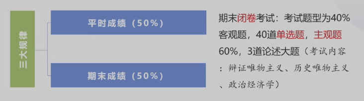
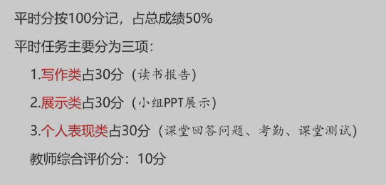
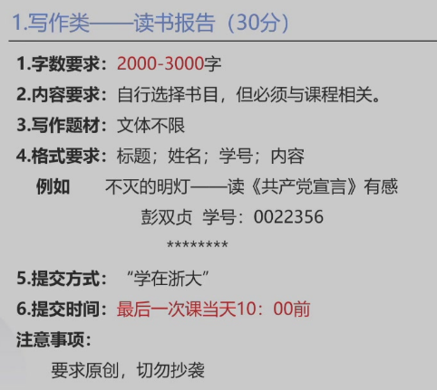
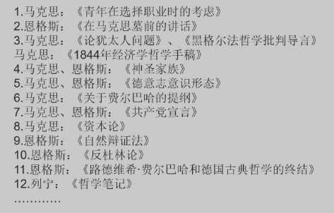
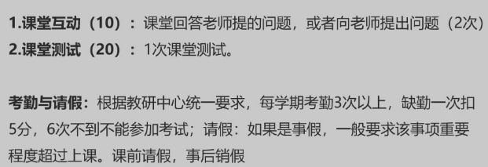
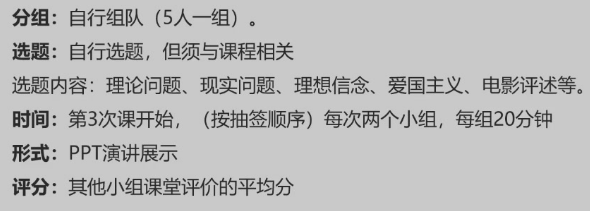
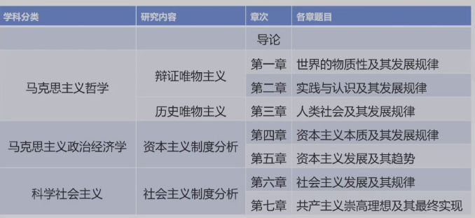
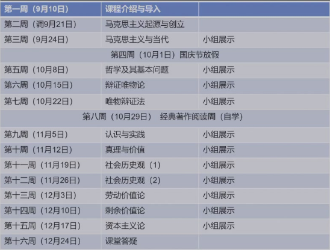

# 课程介绍

## 成绩构成

* 平时成绩50%，期末50%
* 期末闭卷考试，成绩需要高于40分
* 答题的顺序、内容不会变

### 平时成绩

* **教师综合评分会给满(10分)**，前提是需要到一次

#### 读书报告

##### 书单

> 《理想国》《第一哲学沉思集》《偶像的黄昏》《哲学导论》《中国哲学史》

#### 个人表现类

* **小测1次**，论述题，**开卷**，学过的，会有通知
* 考勤来两次就可以了

#### 小组展示类

* 选题需要向助教汇报
* 展示基准分数25分
* **整个小组一个分数**

## 课程构成

* 科学社会主义放在导论里面讲

## 课程安排

